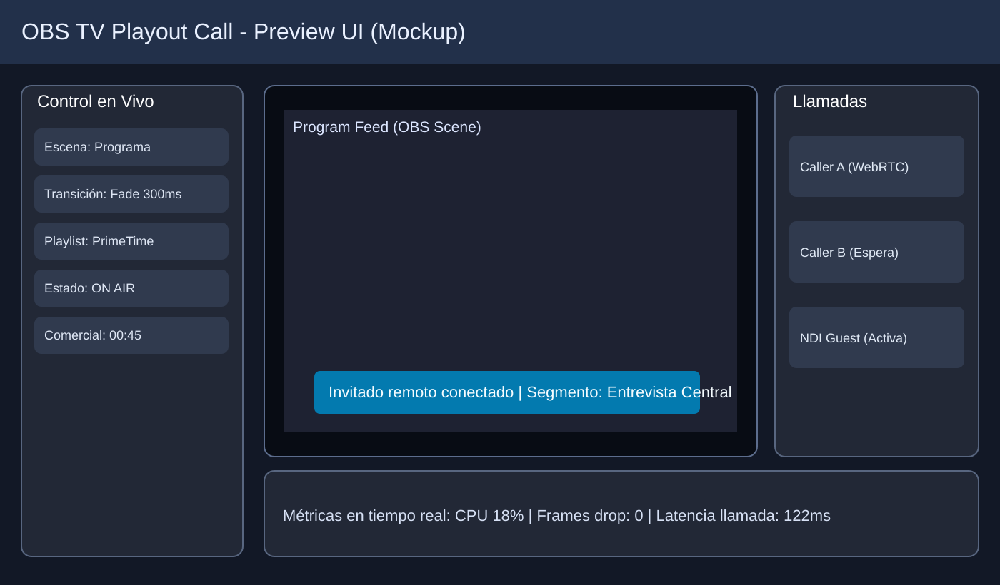
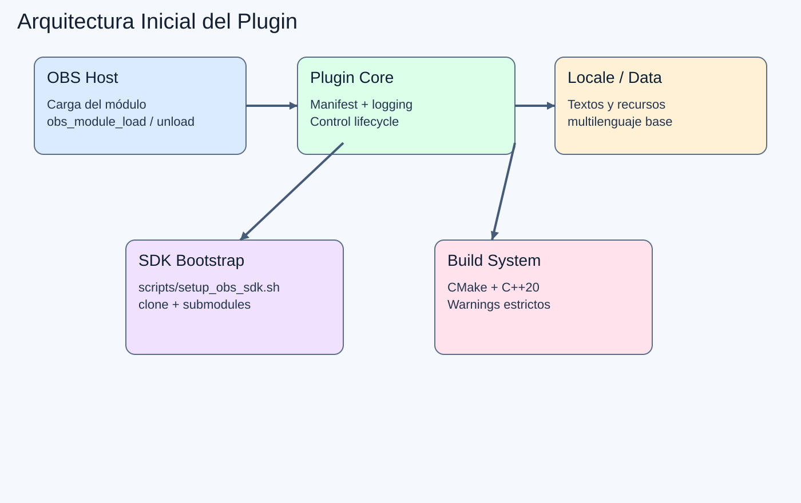

# OBS-Studio-TV-Playout-Call-Plugin-Beta-

Plugin para OBS Studio enfocado en automatización de playout estilo TV broadcast, control remoto desde móvil web y base para un sistema de llamadas propio integrado en escenas de OBS.

## Estado actual

Este repositorio incluye un starter profesional de plugin nativo para OBS con CMake, estructura modular y script de bootstrap para descargar la librería base de OBS Studio.

## Preview visual del proyecto

> Estas imágenes son una **preview de diseño objetivo (mockup)** para que puedas visualizar el resultado esperado del panel broadcast y su arquitectura técnica.

### 1) Preview UI broadcast (mockup)



### 2) Arquitectura inicial del plugin



## Arquitectura inicial

- `src/plugin-main.cpp`: punto de entrada del módulo de OBS.
- `include/obs_tv_playout/core/plugin_manifest.hpp`: metadatos tipados del plugin.
- `scripts/setup_obs_sdk.sh`: descarga/actualiza OBS Studio (fuente + submódulos).
- `data/locale/en-US.ini`: textos localizados visibles dentro de OBS.

## Requisitos

- CMake 3.24+
- Compilador C++20 (MSVC, Clang o GCC)
- Git
- Dependencias de compilación de OBS según tu SO

## Descargar librería base de plugins OBS

```bash
./scripts/setup_obs_sdk.sh
```

## Compilar el plugin

```bash
cmake -S . -B build
cmake --build build
```
